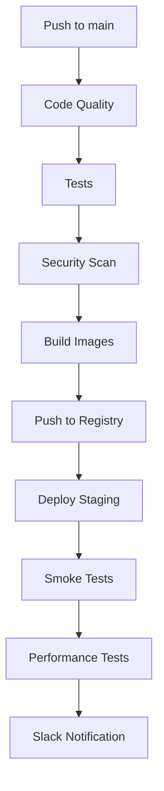

# 🚀 CI/CD Pipeline - Prospecter-Fichap

## 📋 Overview

Este proyecto utiliza **GitHub Actions** para automatizar el proceso de integración continua y despliegue continuo (CI/CD).

## 🔧 Workflows Configurados

### 1. **CI/CD Principal** (`ci-cd.yml`)
Pipeline completo que incluye:

**🧪 Code Quality:**
- ✅ ESLint y Prettier
- ✅ Tests con cobertura
- ✅ SonarQube analysis
- ✅ Generación de badges de cobertura

**🔒 Security Scanning:**
- ✅ Trivy (vulnerabilidades)
- ✅ OWASP ZAP (seguridad web)
- ✅ Snyk (dependencias)
- ✅ Semgrep (código estático)

**🐳 Build & Deploy:**
- ✅ Build de imágenes Docker
- ✅ Push a Docker Registry
- ✅ Deploy automático a staging
- ✅ Smoke tests
- ✅ Notificaciones Slack

**⚡ Performance:**
- ✅ Tests de carga con k6
- ✅ Métricas de performance

### 2. **CodeQL Analysis** (`codeql.yml`)
- 🔍 Análisis estático de seguridad
- 🎯 Detección de vulnerabilidades
- 📊 JavaScript/TypeScript

### 3. **Snyk Security** (`snyk.yml`)
- 🛡️ Escaneo de dependencias
- 🐳 Análisis de imágenes Docker
- 📋 Reportes de vulnerabilidades

### 4. **Semgrep Analysis** (`semgrep.yml`)
- 🔎 Análisis estático avanzado
- 🔒 Detección de secretos
- ⚠️ OWASP Top 10
- 🚨 Patrones de seguridad

## 🔑 Secrets Requeridos

Para que los workflows funcionen correctamente, configura estos secrets en GitHub:

### **Calidad de Código:**
```bash
SONAR_TOKEN          # Token de SonarQube
CODECOV_TOKEN        # Token de Codecov
```

### **Seguridad:**
```bash
SNYK_TOKEN           # Token de Snyk
SEMGREP_APP_TOKEN    # Token de Semgrep
```

### **Docker Registry:**
```bash
DOCKER_USERNAME      # Usuario de Docker Hub
DOCKER_REGISTRY_TOKEN # Token de Docker Hub
```

### **Deployment:**
```bash
STAGING_HOST         # IP/dominio del servidor staging
STAGING_USER         # Usuario SSH
STAGING_SSH_KEY      # Clave privada SSH
```

### **Notificaciones:**
```bash
SLACK_WEBHOOK_URL    # Webhook de Slack
```

## 🎯 Triggers

### **Push a `main`:**
- ✅ Pipeline completo
- ✅ Build de imágenes
- ✅ Deploy a staging
- ✅ Tests de performance

### **Pull Request:**
- ✅ Code quality
- ✅ Tests
- ✅ Security scanning
- ❌ No deploy

### **Schedule:**
- ✅ Security scans nocturnos
- ✅ Dependency updates

## 📊 Artifacts

Los workflows generan estos artifacts:

| Artifact | Descripción |
|----------|-------------|
| `coverage-report` | Reportes de cobertura |
| `coverage-badge` | Badge de cobertura |
| `snyk-report` | Reporte de Snyk |
| `semgrep-report` | Reporte de Semgrep |
| `performance-results` | Resultados de k6 |

## 🏗️ Arquitectura de Deploy



## 🚨 Troubleshooting

### **VS Code Warnings**
Los warnings de "Unable to resolve action" en VS Code son **normales** - no puede verificar acciones de GitHub localmente.

### **Failed Workflows**
1. **Secrets no configurados** → Agregar en GitHub Settings
2. **Tests fallando** → Revisar logs del workflow
3. **Deploy fallando** → Verificar SSH y servidor staging

### **Security Scans**
- **Snyk** → Revisa dependencias desactualizadas
- **Semgrep** → Revisa patrones inseguros en código
- **Trivy** → Revisa vulnerabilidades en containers

## 📈 Métricas y Monitoring

- **Coverage:** Codecov dashboard
- **Security:** GitHub Security tab
- **Performance:** Artifacts de k6
- **Quality:** SonarQube dashboard

## 🔄 Maintenance

### **Dependencias del Pipeline:**
```bash
# Actualizar acciones periodicamente
actions/checkout@v4 → v5
actions/setup-node@v4 → v5
docker/build-push-action@v5 → v6
```

### **Security Updates:**
- Revisar mensualmente reportes de Snyk
- Actualizar imágenes base de Docker
- Rotar secrets cada 6 meses

---

## ✅ Status

| Component | Status | Last Update |
|-----------|--------|-------------|
| CI/CD Pipeline | ✅ Active | 2024-01-15 |
| Security Scanning | ✅ Active | 2024-01-15 |
| Auto Deploy | ✅ Active | 2024-01-15 |
| Performance Tests | ✅ Active | 2024-01-15 |

**Pipeline completamente funcional y optimizado** 🚀 