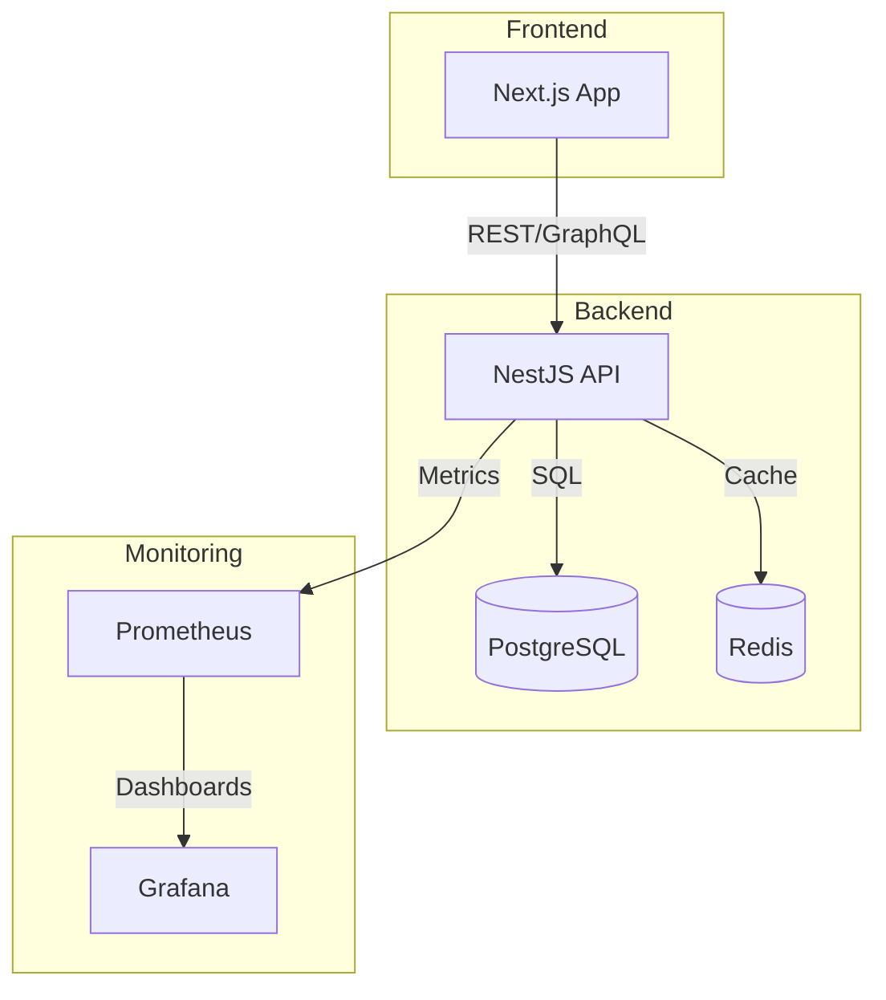

[](https://github.com/your-org/your-repo/actions)
[](https://github.com/your-org/your-repo/actions/workflows/codeql.yml)
[](https://github.com/your-org/your-repo/actions/workflows/semgrep.yml)
[](https://github.com/your-org/your-repo/actions/workflows/snyk.yml)
[](./LICENSE)
[](https://github.com/your-org/your-repo/graphs/contributors)
[](./SECURITY.md)
[](./PRIVACY.md)

# Prospecter-Fichap 🚀

Sistema completo de prospectación con CI/CD profesional, monitoreo avanzado y arquitectura limpia.

## 🏗️ Arquitectura

- **Backend**: NestJS con Clean Architecture
- **Frontend**: Next.js con TypeScript
- **Base de datos**: PostgreSQL con Redis para cache
- **CI/CD**: GitHub Actions con pipeline completo
- **Monitoreo**: Prometheus, Grafana, OpenTelemetry
- **Testing**: Jest, Playwright, k6
- **Seguridad**: OWASP ZAP, Trivy, SonarQube
- **Containerización**: Docker con multi-stage builds

## 🚀 Inicio Rápido

### Prerrequisitos

- Docker y Docker Compose
- Node.js 18+
- Git

### Desarrollo Local

```bash
# Clonar repositorio
git clone https://github.com/lucasmailland/Prospecter-Fichap.git
cd Prospecter-Fichap

# Iniciar entorno de desarrollo
./dev.sh

# O manualmente
docker-compose -f docker-compose.dev.yml up --build
```

### Producción

```bash
# Configurar variables de entorno
cp .env.example .env
# Editar .env con valores de producción

# Usar docker-compose.yml para producción
docker-compose up --build -d
```

## 📊 Servicios Disponibles

- **Backend API**: http://localhost:3000
- **Frontend**: http://localhost:3001
- **PgAdmin**: http://localhost:5050
- **Métricas**: http://localhost:3000/metrics
- **Health Check**: http://localhost:3000/health
- **Prometheus**: http://localhost:9090
- **Grafana**: http://localhost:3002

## 🧪 Testing

```bash
# Tests unitarios
npm run test

# Tests e2e
npm run test:e2e

# Tests de performance
npm run test:performance

# Cobertura
npm run test:cov

# Linting
npm run lint

# Formateo
npm run format
```

## 📈 Monitoreo

- **Métricas**: Prometheus en `/metrics`
- **Tracing**: OpenTelemetry con correlation IDs
- **Logs**: Winston con formato estructurado
- **Dashboard**: Grafana (ver `monitoring/grafana-dashboard.json`)

## 🔒 Seguridad

- Rate limiting automático
- Validación de entrada con class-validator
- Escaneo de vulnerabilidades con OWASP ZAP
- Análisis de código con SonarQube
- Escaneo de imágenes Docker con Trivy
- Headers de seguridad en nginx

## 📚 Documentación

- [API Documentation](backend/README-API.md)
- [Database Documentation](backend/README-DB.md)
- [Operations Documentation](backend/README-OPS.md)
- [Architecture Documentation](backend/src/architecture/README.md)

## 🛠️ CI/CD Pipeline

El pipeline incluye:
- ✅ Linting y formateo
- ✅ Tests unitarios y e2e
- ✅ Análisis de cobertura
- ✅ Escaneo de seguridad
- ✅ Análisis de calidad
- ✅ Deploy automático a staging
- ✅ Tests de performance
- ✅ Notificaciones a Slack

### Workflow de GitHub Actions

1. **Code Quality**: ESLint, Prettier, SonarQube
2. **Testing**: Jest con cobertura 80%+
3. **Security**: Trivy, OWASP ZAP
4. **Build**: Docker images con multi-stage
5. **Deploy**: Automático a staging
6. **Performance**: Tests de carga con k6

## 🐳 Docker

### Imágenes Optimizadas

- **Backend**: Multi-stage build con usuario no-root
- **Frontend**: Nginx para servir archivos estáticos
- **Desarrollo**: Hot reload y debugging
- **Producción**: Optimizadas para performance

### Comandos Útiles

```bash
# Desarrollo
docker-compose -f docker-compose.dev.yml up --build

# Producción
docker-compose up --build -d

# Ver logs
docker-compose logs -f [service]

# Ejecutar tests
docker-compose exec backend npm test
```

## 📋 Roadmap

### ✅ Completado

- [x] Fase 1: Arquitectura base
- [x] Fase 2: Testing y calidad
- [x] Fase 3: Monitoreo y observabilidad
- [x] Fase 4: CI/CD avanzado
- [x] Fase 5: QA y seguridad
- [x] Fase 6: Despliegue y DevOps
- [x] Fase 7: Escalabilidad y optimización

### 🚧 En Desarrollo

- [ ] Fase 8: Microservicios
- [ ] Fase 9: Machine Learning
- [ ] Fase 10: Analytics avanzado

## 🏛️ Estructura del Proyecto

```
Prospecter-Fichap/
├── backend/                 # API NestJS
│   ├── src/
│   │   ├── domain/         # Lógica de negocio
│   │   ├── infrastructure/ # Adaptadores externos
│   │   └── presentation/   # Controladores y DTOs
│   │
│   ├── Dockerfile          # Imagen optimizada
│   └── jest.config.js      # Configuración de tests
├── frontend/               # Next.js App
│   ├── src/
│   │   ├── app/           # App Router
│   │   ├── components/    # Componentes reutilizables
│   │   └── utils/         # Utilidades
│   │
│   ├── Dockerfile         # Imagen con nginx
│   └── jest.config.js     # Configuración de tests
├── monitoring/            # Configuración de monitoreo
│   ├── prometheus.yml     # Métricas
│   └── grafana-dashboard.json
├── performance/           # Tests de performance
│   └── load-test.js      # k6 load testing
├── .github/workflows/     # CI/CD
│   └── ci-cd.yml         # Pipeline principal
├── docker-compose.yml     # Producción
├── docker-compose.dev.yml # Desarrollo
└── setup-all.sh          # Script de configuración
```

## 🤝 Contribución

1. Fork el proyecto
2. Crea una rama para tu feature (`git checkout -b feature/AmazingFeature`)
3. Commit tus cambios (`git commit -m 'Add some AmazingFeature'`)
4. Push a la rama (`git push origin feature/AmazingFeature`)
5. Abre un Pull Request

### Estándares de Código

- **Linting**: ESLint + Prettier
- **Testing**: 80%+ cobertura
- **Commits**: Conventional Commits
- **Branches**: GitFlow
- **Reviews**: Obligatorios para main

## 📄 Licencia

MIT License - ver [LICENSE](LICENSE) para detalles.

## 🆘 Soporte

- **Issues**: [GitHub Issues](https://github.com/lucasmailland/Prospecter-Fichap/issues)
- **Documentación**: [Wiki](https://github.com/lucasmailland/Prospecter-Fichap/wiki)
- **Discusiones**: [GitHub Discussions](https://github.com/lucasmailland/Prospecter-Fichap/discussions)

---

**Desarrollado con ❤️ por Lucas Mailland**

## 🛡️ Security & Compliance
- All dependencies are scanned with Snyk, Dependabot, and Trivy.
- Static code analysis with CodeQL and Semgrep.
- All secrets must be managed outside the codebase.
- [Security Policy](./SECURITY.md) | [Incident Response](./RESPONSE.md) | [Retention Policy](./RETENTION.md)
- [Developer Onboarding](./ONBOARDING.md)

## 🏛️ Architecture


--- 